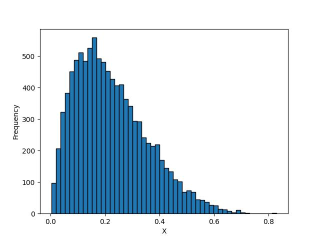
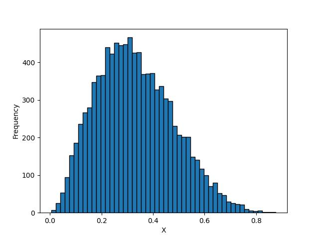
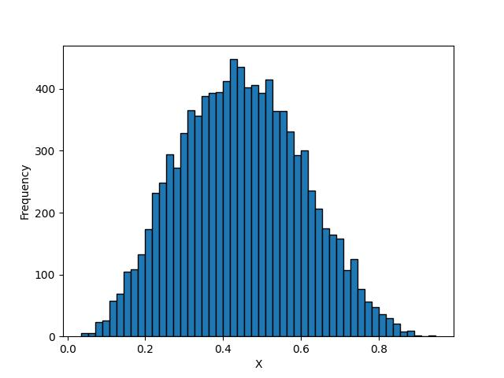
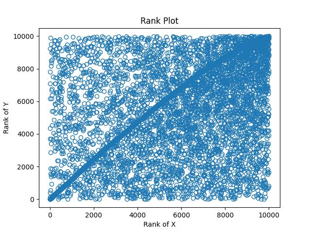

## 1.

### 1(a)

### Algorithm accept_rejection_algorithm

**INPUT:**

- target_pdf: The pdf we want to generate samples
- proposal_pdf: The pdf easy to sample and with same support to target_pdf
- M: The upper bound of the target_pdf
- d: The dimensions of the random vectors

**OUTPUT:**

An array of shape (d)

**STEPS:**

1. Generated x = g(x) where g ~ Unif(0,1)^d, p ~ Unif(0,1).
2. g = g / g.sum()
3. Set accept_probability = pdf(x) / M
4. Repeat above steps until p <= accept_probability
5. Return the accepted samples.

#### Code

### 1(b)

```python
def compute_M(grid):
    res = np.apply_along_axis(lambda x: dirichlet(x), 1, grid)
    return max(res)

grid = np.random.uniform(0,1,3*10000).reshape(10000,3)
grid = np.apply_along_axis(lambda x: x / x.sum(), 1, grid)
M = compute_M(grid)

def accept_rejection_algorithm(pdf, M, dims=3):
    while True:
        x = np.random.uniform(0, 1, dims)
        x = x / x.sum()
        y = np.random.uniform(0, 1)
        if y*M <= pdf(x):
            return x
```

We compute the upper bound M is 7.77..., then samples 10^4 points.

#### Histogram

The following manner is the histogram of x1, x2 and x3


#### Result

```python
Samples Mean: [0.25305712 0.34069322 0.40624966]
Samples Covariance Matrix: [[ 0.01498779 -0.00742769 -0.0075601 ]
 [-0.00742769  0.01496395 -0.00753626]
 [-0.0075601  -0.00753626  0.01509636]]
[0.25305712 0.34069322 0.40624966]
```

### 1(c)

**INPUT:**
- a vector of concentration parameters α = (α_1, α_2, ..., α_k)
size: number of samples to generate

**OUTPUTS:**

An array of shape (size)

**STEPS:**
1. For i in range(1, k), sample Gamma(α_i, 1) and store it in a vector g_i.
2. Let s = sum(g_i)
3. Let x = g/s. The resulting vector x is a sample from a Dirichlet distribution with parameters α.

### 1(d)

#### Code

```python
def gamma_sample(shape, scale=1, size=1, max_iter=10000):
    """
    Generate random samples from the gamma distribution with shape parameter `shape`
    and scale parameter `scale` using the acceptance-rejection method.

    Parameters
    ----------
    shape : float
        Shape parameter of the gamma distribution.
    scale : float, optional
        Scale parameter of the gamma distribution.
    size : int or tuple of ints, optional
        Output shape. If the given shape is, e.g., (m, n, k),
        then m * n * k samples are drawn.
    max_iter : int, optional
        Maximum number of iterations to perform.

    Returns
    -------
    ndarray
        Random samples from the gamma distribution with shape (size,).
    """
    x = np.zeros(size)
    for i in range(size):
        # Rejection sampling loop
        for j in range(max_iter):
            # Generate candidate sample from uniform distribution
            y = np.random.uniform()
            # Calculate the candidate sample
            candidate = -np.log(y)
            if np.random.uniform() <= candidate ** (shape - 1) * np.exp(-candidate / scale) / (np.math.gamma(shape) * scale ** shape):
                break
        x[i] = candidate
    return x

def dirichlet_sample(alpha, size=10000):
    """
    Generate random samples from the Dirichlet distribution with parameter vector alpha.

    Parameters
    ----------
    alpha : array-like
        Parameter vector of length K.
    size : int or tuple of ints, optional
        Output shape. If the given shape is, e.g., (m, n, k),
        then m * n * k samples are drawn.

    Returns
    -------
    ndarray
        Random samples from the Dirichlet distribution with shape (size, K).
    """
    alpha = np.array(alpha)
    if alpha.ndim == 0:
        alpha = alpha[np.newaxis]
    x = np.zeros((size, len(alpha)))
    for i in range(size):
        # Generate gamma samples using acceptance-rejection method
        gammas = np.array([gamma_sample(a) for a in alpha])
        x[i] = gammas.squeeze(-1) / np.sum(gammas)
    return x
```

#### Histogram

The following manner is the histogram of x1, x2 and x3





#### Result

```
Samples Mean: [0.22199472 0.33263359 0.4453717 ]
Samples Covariance Matrix: [[ 0.01706992 -0.00717531 -0.00989461]
 [-0.00717531  0.02235337 -0.01517806]
 [-0.00989461 -0.01517806  0.02507267]]
```

## 2.

### 2(a)

#### Algorithm rCopula

**INPUT:**

size, lambda1, lambda2, lambda3

**OUTPUT:**

An array of size (size * 2)

**STEPS:**

1. Generate T_i ~ Exp(lambda_i) for i = 1,2,3
2. Set X=min(T1, T3), Y=min(T2, T3)
3. Return Vector (X, Y)
4. Repeat above n times

### 2(b)

#### Code

```python
def rCopula(n, lambda_):
    samples = []
    for _ in range(n):
        t1 = np.random.exponential(1/lambda_[0])   # T_1 ~ Exp(lambda_1)
        t2 = np.random.exponential(1/lambda_[1])   # T_2 ~ Exp(lambda_2)
        t3 = np.random.exponential(1/lambda_[2])   # T_3 ~ Exp(lambda_3)
        x = min(t1, t3)   # P = min(T_1, T_3)
        y = min(t2, t3)   # Q = min(T_2, T_3)
        samples.extend([x, y])
    samples = np.array(samples).reshape(n, 2, order='F')
    return samples
```

#### Rank Plot



### 2(c)

#### Algorithm moCopula

**INPUT:**

size, mu_z, mu_w, sigma_z, sigma_w, lambda1, lambda2, lambda3

**OUTPUT:**

An array of size (size * 2)

**STEPS:**

1. Set X, Y = rCopula(size, lambdas) as described in 2(b)
2. Normalize Z = Z / sigma_z - mu_z, W = W / sigma_w - mu_w
3. Return Vector (phi(exp{-(lambda1+lambda3)X}), phi(exp{-(lambda2+lambda3)X})) where phi is the quantile of standard normal dist.
4. Repeat above n times

### 2(d)

#### Code 

```python
def moCopula(size, mu_z, mu_w, sigma_z, sigma_w, lambda1, lambda2, lambda3):
    # Step 1
    samples = rCopula(size, [lambda1, lambda2, lambda3]) # Assuming rCopula is defined and returns X and Y
    X, Y = samples[...,0], samples[...,1]
    
    # Step 3
    phi = norm.ppf
    result = np.empty((size, 2))
    for i in range(size):
        x = np.exp(-(lambda1 + lambda3) * X[i])
        y = np.exp(-(lambda2 + lambda3) * Y[i])
        result[i] = [phi(x, loc=mu_z, scale=sigma_z), phi(y, loc=mu_w, scale=sigma_w)]

    return result
```

#### Result

```
Z mean: 0.10469065841740487
Z covariance:
 0.9584681319533541
W mean: -2.2539990107143337
W covariance:
 4.344281139586187
```

#### Scatter Plot 

The x axis is Z, y axis is W


## 3.

### 3(a)

#### Procedure

**STEPS:**
1. Given a sample of size n, compute the estimator of interest for the full sample.
2. For each i-th observation in the sample, remove that observation and compute the estimator of interest based on the remaining n-1 observations. Repeat this process for all i=1,2,...,n.
3. Compute the Jackknife estimate of the estimator by taking the average of the estimator computed in step 2 for all i=1,2,...,n.
4. Compute the Jackknife variance estimate of the estimator by using the formula:
J.var = (n-1) / n * Σ_i=1^n (θ_i - θ_J)^2
where θ_i is the estimator computed in step 2 for the i-th observation, θ_J is the Jackknife estimate of the estimator computed in step 3, and n is the sample size.
5. Compute the Jackknife bias estimate of the estimator by using the formula:
J.bias = (n-1) * (θ_J - θ)
where θ_J is the Jackknife estimate of the estimator computed in step 3, θ is the estimator computed for the full sample in step 1, and n is the sample size.
6. Compute the Jackknife confidence interval of the estimator using the formula:
CI = (θ_J - z_alpha/2 * SE, θ_J + z_alpha/2 * SE)
where θ_J is the Jackknife estimate of the estimator computed in step 3, z_alpha/2 is the (1-alpha/2)-th percentile of the standard normal distribution, and SE is the Jackknife standard error estimate of the estimator given by SE = sqrt(J.var).

#### Code

```python
# Calculate the sample median
sample_median = np.median(data)

# Create n jackknife samples
jackknife_medians = np.zeros(n)
for i in range(n):
    jackknife_sample = np.delete(data, i)
    jackknife_medians[i] = np.median(jackknife_sample)

# Calculate the bias of the sample median
bias_median = (n - 1) * (np.mean(jackknife_medians) - sample_median)

# Calculate the variance of the sample median
var_median = (n - 1) / n * np.sum((jackknife_medians - np.mean(jackknife_medians)) ** 2)

# Calculate the standard error of the sample median
se_median = np.sqrt(var_median)

# Calculate the z-score for the desired confidence level (e.g., 95%)
alpha = 0.05
z = 1.96

# Calculate the confidence interval
lower = sample_median - z * se_median
upper = sample_median + z * se_median
```

#### Histogram


From hist plot, only 0.3273, 0.4449 are estimated, and we take the mean 

#### Result

```
Sample median: 0.3861
Bias of the sample median: -0.0000
Variance of the sample median: 0.0657
Standard error of the sample median: 0.2563
95% Confidence interval: [-0.1163, 0.8885]
```

### 3(b)

#### Procedure

**STEPS:**
1. Start with a sample of size n from a population.
2. Draw a large number of random samples (with replacement) of the same size n from the original sample. The number of samples drawn is denoted by B and is typically set to a large number, e.g., 10,000.
3. Compute the statistic of interest (median) for each of the B samples. This statistic could be the mean, median, standard deviation, or any other statistic of interest.
4. Estimate the sampling distribution of the statistic by computing the empirical distribution of the B statistics obtained in step 3. This can be done by plotting a histogram or kernel density estimate of the B statistics.
5. Use the empirical distribution to estimate the standard error, confidence interval, or p-value of the statistic of interest.

#### Code 

```python
# Define the number of bootstrap samples to create
B = 10**4

# Define the sample size
n = len(data)

# Calculate the sample median
sample_median = np.median(data)

# Create B bootstrap samples
bootstrap_medians = np.zeros(B)
for i in range(B):
    bootstrap_sample = np.random.choice(data, size=n, replace=True)
    bootstrap_medians[i] = np.median(bootstrap_sample)

# Calculate the bias of the sample median
bias_median = np.mean(bootstrap_medians) - sample_median

# Calculate the variance of the sample median
var_median = np.mean((bootstrap_medians - np.mean(bootstrap_medians)) ** 2)

# Calculate the standard error of the sample median
se_median = np.sqrt(var_median)

# Calculate the z-score for the desired confidence level (e.g., 95%)
alpha = 0.05
z = 1.96

# Calculate the confidence interval
lower = sample_median - z * se_median
upper = sample_median + z * se_median
```

#### Histogram


#### Result

```
Sample median: 0.3861
Bias of the sample median: -0.0146
Variance of the sample median: 0.0243
Standard error of the sample median: 0.1559
95% Confidence interval: [0.0805, 0.6917]
```

### 3(c)

#### Procedure

**STEPS:**
1. Estimate the unknown parameters (a, b) of the Beta distribution based on the original data.
2. Generate a large number of bootstrap samples by drawing samples with replacement from the estimated Beta distribution.
3. Compute the statistic of interest for each of the bootstrap samples.
4. Calculate the bootstrap estimate of the statistic by taking the average of the computed statistics from step 3.
5. Repeat steps 2-4 a large number of times to obtain the bootstrap distribution of the statistic.
6. Approximate the p-value of the observed statistic by calculating the proportion of bootstrap statistics that are equal to or greater than the observed statistic.

#### Code

```python
# Estimate the parameters of the beta distribution
a, b, _, _ = beta.fit(data.flatten())

# Generate 10^4 random samples from the estimated beta distribution
n_samples = 10**4
bootstrap_samples = beta.rvs(a, b, size=(n_samples, data.shape[0], data.shape[1]))

# Calculate the sample medians for each bootstrap sample
sample_medians = np.median(bootstrap_samples, axis=(1, 2))

# Calculate the mean and standard deviation of the sample medians
mean_sample_medians = np.mean(sample_medians)
std_sample_medians = np.std(sample_medians, ddof=1)

# Construct the 95% confidence interval
lower_bound = mean_sample_medians - 1.96 * std_sample_medians
upper_bound = mean_sample_medians + 1.96 * std_sample_medians
```

#### Histogram


From the plot, the samples madians approximate normal dist, therefore, we construct the normal 95% CI

#### Result

```
95% Confidence Interval: (0.14451056518377803, 0.7393876299373726)
```

## 4.

### 4(a)

#### KSdist

```python
def ks_statistic(data, p):
    x = np.sort(data)
    n = len(x)
    F = binom.cdf(x, n=8, p=p)
    D = np.max(np.abs(F - np.arange(1, n+1)/n))
    return D
```

#### MLE

```python
p_vals = np.mean(data) / 8
```

#### Result

```
KS statistic: 0.31788755799247936
p with KS statistic: 0.6180555555555556
Minimum KS statistic: 0.2973292727063638
p with minimum KS statistic: 0.66
```

### 4(b)

**Input:** 

- data: array of observed data
- n_boot: number of bootstrap samples
- alpha: significance level

**Output:**

- p_value: estimated p-value

**STEPS:**

1. Define function KS(data) to calculate the Kolmogorov-Smirnov statistic for a given data set.
2. Compute the Kolmogorov-Smirnov statistic (KSdist) for the observed data using KS(data).
3. Compute the MLE for the binomial distribution (MLE) as MLE = data.mean() / 8.
4. Generate n_boot bootstrap samples by sampling with replacement from the observed data and 
   calculating the Kolmogorov-Smirnov statistic for each sample using KS(sample).
5. Calculate the p-value as the proportion of bootstrap samples with a statistic greater than or 
   equal to KSdist.
6. Return the estimated p-value.

### 4(c)

```python
n_samples = int(1e4)
original_data = np.array([6, 7, 3, 4, 7, 3, 7, 2, 6, 3, 7, 8, 2, 1, 3, 5, 8, 7])
p_vals = np.mean(original_data) / 8
boot_samples = np.random.binomial(8,p_vals,len(original_data)*n_samples).reshape(n_samples,-1)

# Compute Kolmogorov-Smirnov statistic for each bootstrap sample
boot_stats = np.apply_along_axis(ks_statistic, axis=0, arr=boot_samples)

# Compute p-value
observed_stat = ks_statistic(original_data)
p_value = np.mean(boot_stats >= observed_stat)
```

#### Result

```python
Observed KS statistic: 0.31788755799247936
Booststrap KS statistic: 0.26935147577491986
Bootstrap p-value: 0.2458
```

The p-value of the test > 0.05 --> Do not reject --> We don't have any significant evidence that the data are not from Bin(8,p)